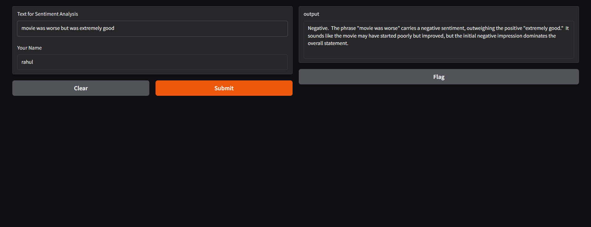
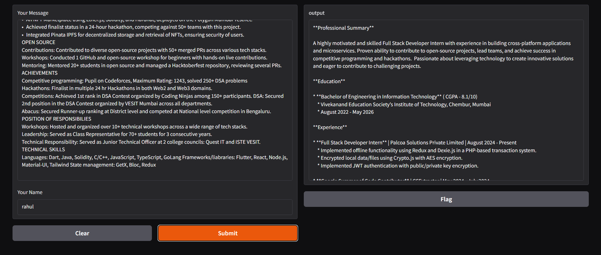

# AI Tools Collection

This repository contains a collection of AI-powered tools designed to assist users in various tasks, from personalized learning to contract review. Below are the details of each tool, along with relevant screenshots.

---

## 1. Email Writer
An intelligent assistant that helps you write,send and draft you emails.

### Screenshots
- Screenshot 1: 

---

## 2. Personal Medical Assistant
A chatbot that keeps track of symptoms and vitals and also provide you insights of your health to maintain a healty lifestyle and also diagnoise your sickness

### Screenshots
- Screenshot 1: 
- Screenshot 1: 
---

## 3. Medical Report Summarizer
Summarizes the medical report and also provides remidies to improve your health

### Screenshots
- Screenshot 1: 
- Screenshot 1: 

## 4. Data_Report_Generator
An AI-driven tool that provides complete report of the data(.csv).

### Screenshots
- Screenshot 1: 
- Screenshot 1: 
---

## 5. Diagnoses bot
This is a bot specialized in that is specialized in dianosing the patients based on their symptoms and providing the cure and remedies
### Screenshots
- Screenshot 1: 
- Screenshot 1: 
---

## 6. Sentiment Analysis
Chatbot that does sentiment analysis based on the text you provide by extracting required terms.
### Screenshots
- Screenshot 1: 
- Screenshot 1: 
---

## 7. Resume Builder
The chatbot that has immense ability to provide neat ats resume format based on your details

### Screenshots
- Screenshot 4: 
- Screenshot 4: 
---

## 8. Product Description
Analyzes the nutritional content of food items and provides detailed information about their health benefits and risks.

### Screenshots
- Screenshot 1: 
- Screenshot 2: 

---

## 9. text Summarizer
By providing the pdf it provides detailed summary of the document.

### Screenshots
- Screenshot 1: 

---

### Resource Usage

All tools are optimized for lightweight performance and can run efficiently on devices with:
- **Processor**: Minimum Intel i5/AMD Ryzen 3 (or equivalent)
- **RAM**: At least 8 GB recommended
- **Storage**: Less than 200 MB for installation files
- **Internet Connection**: Required for AI-based processing (for tools like video summarization or contract review)

Each tool is designed to maximize efficiency while minimizing resource consumption, ensuring compatibility with most modern systems.
