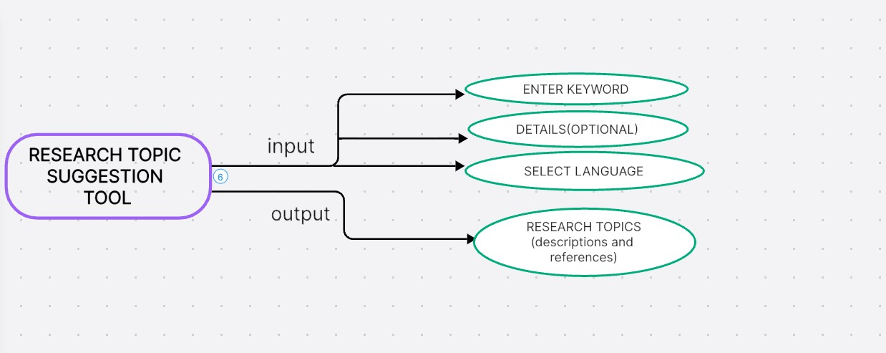

AI TOOLS:

1.QUIZ AND ASSESSMENT GENERATOR

A tool that generates and evaluates quizzes from uploaded files or user-provided topics using AI.

INPUT SCREENSHOTS:

- Screenshot 1: 

OUTPUT SCREENSHOTS:

- Screenshot 1: 

- Screenshot 2: 

- Screenshot 3: 

MINDMAP:

Screenshot 1: 

2.FLASHCARD GENERATOR

This tool allows users to generate flashcards from a provided topic or text extracted from uploaded image or PDF files .

INPUT SCREENSHOTS:

- Screenshot 1: 

OUTPUT SCREENSHOTS:

- Screenshot 1: 

MINDMAP:

- Screenshot 1: 

3.EDUCATION CONTENT SUMMARIZER

AI-powered tool for summarizing educational content, generating quizzes, and comparing documents from PDFs and images.

 SCREENSHOTS:

- Screenshot 1: 

- Screenshot 2: 

- Screenshot 3: 

- Screenshot 4: 

MINDMAP:

Screenshot 4: 

4.RESEARCH TOPIC SUGGESTION TOOL:

A tool for generating unique research topics with descriptions and references.

INPUT SCREENSHOTS:

- Screenshot 1: 

OUTPUT SCREENSHOTS:

- Screenshot 1: 

- Screenshot 2: 

MINDMAP:

Screenshot 4: 

5.CODE_DOCUMENTATION_GENERATOR

A tool to generate detailed documentation and explanations for code snippets or uploaded files .

INPUT SCREENSHOTS:

- Screenshot 1: 

OUTPUT SCREENSHOTS:

- Screenshot 1: 

- Screenshot 2: 

MINDMAP:

Screenshot 4: 

6.DIY PROJECT PLANNER

A tool to create a DIY Project Planner that generates project plans using the Gemini API, allows users to save and manage projects, and provides download options for detailed project documentation.

INPUT SCREENSHOTS:

 Screenshot 1: 

OUTPUT SCREENSHOTS:

 Screenshot 1: 

 Screenshot 2: 

MINDMAP:

Screenshot 4: 

7.MENU PLANNING ASSISTANT

Personalized 7-day meal planner using AI, tailored to health goals, preferences, and medical needs.

INPUT SCREENSHOTS:

Screenshot 1: 

Screenshot 2: 

OUTPUT SCREENSHOTS:

Screenshot 1: 

Screenshot 2: 

MINDMAP:

Screenshot 4: 

8.NUTRITION PLANNER

A personalized 1-day meal planner with multiple options per meal, tailored to health goals, preferences, allergies, and medical conditions.

INPUT SCREENSHOTS:

Screenshot 1: 

OUTPUT SCREENSHOTS:

Screenshot 1: 

Screenshot 2: 

MINDMAP:

Screenshot 4: 

9.RECIPE COST ESTIMATOR

A tool for generating unique recipes with estimated ingredient costs in INR and USD .

INPUT SCREENSHOTS:

Screenshot 1: 

OUTPUT SCREENSHOTS:

Screenshot 1: 

Screenshot 2: 

MINDMAP:

Screenshot 4: 

10.WINE PAIRING TOOL

A tool for wine pairing suggestions based on multiple food items.

INPUT SCREENSHOTS:

Screenshot 1: 

OUTPUT SCREENSHOTS:

Screenshot 1: 

MINDMAP:

Screenshot 4: 

11.LEGAL POINT GENERATOR:

AI-driven tool for generating detailed legal arguments and counterarguments from uploaded documents or text inputs.

INPUT SCREENSHOTS:

Screenshot 1: 

Screenshot 2: 

OUTPUT SCREENSHOTS:

Screenshot 1: 

MINDMAP:

Screenshot 4: 

 

